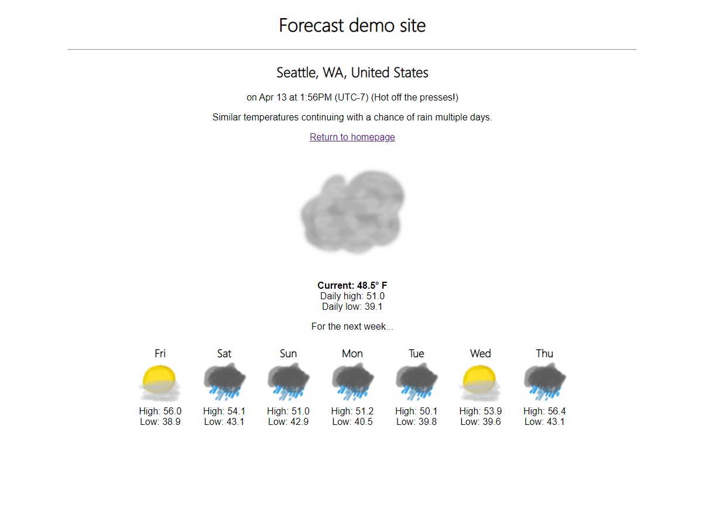

# README

This is a Ruby on Rails demo project that gets and displays a weather forecast.



## Build

Before building the project, make sure to put the `master.key` file in the
`./config` directory, or the remote calls to the weather and location services
won't work (if you don't have this, you can email me at curtmccoy+gh@gmail.com).

To build, it should be fairly standard - just `bundle install` and
`bundle update`, after which `rails server` should start it up with a puma
instance. After which, connect a browser to `localhost:3000` and the home search
page should be displayed.

Note: one of the dependencies for Rails appread to hang during the bundle udpate
process - if the terminal seemingly stalls while building `nokogiri`, it should
be fine. Apparently this is a known issue (and might only have affected me
because I'm on Windows).

## Services

- VisualCrossing Weather API
- Mapquest API
- Geocoder ruby Gem to access data from Mapquest

## Design

Here I'll detail some of the design choices and implementation details.
For some, I'll include a "Next Steps" section to detail how I would continue if
planning to expand on this project.

### UI

There are two pages that will be rendered by this project: a basic search page,
and the forecast page for a given location. Both pages use a shared header.

#### Search UI

The search page uses a simple text entry form that can be submitted either by
using the "Submit" button or pressing enter. An error message will be displayed
if a service can't be accessed or the location entered can't be resolved (for
example, an input of "my house" will cause it to fail to find).

#### Forecast UI

The forecast page displays the resolved location per the Weather API (generally,
the area code, city, state, and country, or the equivalent of those) as well as
the current time in the area along with its UTC offset (this is not necessarily
the local system time, it's the time of the area represented by the forecast).

If the page needed an external request to generate, it will display the message,
"Hot off the presses!". If the data was found in the cache, it will instead say,
"Displaying cached data".

The large central image uses an icon picked from among 7 images based on the
`icon` field in the WeatherAPI data. Above the icon is a plain-text string from
Weather API describing the weather conditions and expectations (for example,
"Similar temperatures continuing with no rain expected"). Below the large image
is the current hourly temperature in Fahrenheit in bold, along with the high and
low values from the daily average data.

Below the central image is the forecast of expected daily averages for the
upcoming week, starting the following day, including the high, low, and a
smaller rendering of the same set of icons for those days.

**Next Steps:**

The data provided by Weather API is very thorough, and there is a lot more
interesting inclusions already present that could be added for display.

One feature I considered adding, but opted against to save on time, was improved
dynamic icons - the data contians a "moonphase" value and sunrise/sunset fields.
My intent was to split the images into foreground and background images, with a
sun and (full) moon for the latter, with the former being reserved for weather
effects from precipitation, so the "partly cloudy" icon would then actually be
the cloud image (with transparency) over the sun image for day, or moon image
for night. I also wanted to use the moon phase to put a period accurate shadow
over the moon image to form crescents.

Another display feature that would be nice to have would be charting for the
weekly temperature. For this I was considering adding a canvas behind the weekly
data display which I could then just draw lines or polygons over to correspond
with the day tiles. These charts could even have fairly high fidelity, as each
day has access to its own set of 24 hours, each of which contains temperature as
well as precipitation data that could also be charted.

It would also be nice to have a toggle that allowed a switch between Fahrenheit
and Celsius - the back-end would stick to one (probably F) and do manual
conversions for display only.

These features would be nice to have, but while they're not necessarily
difficult to implement, front-end work can be very time consuming and this is
supposed to be more of a back-end demo.

### Inputs

Rather than requiring a full address and parsing out a zipcode, I wanted to
support arbitrary inputs (such as partial addresses or landmarks) that could
resolve down to a given location which I could then pull a location code from.
This means I can still cache based on zip per the requirements, but can be a
little more specific by using city names as well (necessary for foreign area
codes which can conflict with US codes).

**Next Steps:**

The inputs don't always resolve accurately - as mentioned, "Eiffel Tower" will
succed, but "Arc de Triomphe" will resolve to "chisinau-2012", a city in
Moldova. The correct result is likely contained in the response from Mapquest,
but becasue I'm currently just choosing the first result, mistakes like this for
more general inputs will be common. Moving forward I'd want to do more research
on this API to help with filtering for relevance, and perhaps add a list
selector for the user to choose.

### Caching

For this project, due to its small scale I opted to just use the default memory
cache that comes with Rails. The Geocoder service includes its own cache to
limit Mapquest API calls, but the Weather API does not as far as I can tell, so
we're using the Rails.cache manually via the `CachedRequest` helper class.

The input method means I can read a general input like "Eiffel Tower" and
transform it into a more reusable cache-key format of "paris-75007", which will
share a cache with, say "79 Av. Bosquet, Paris" if you look up the nearby "Kozy
Bosquet" restaurant. This does put more demand on the Mapquest lookup, which has
a free-tier limit of 15,000 requests per month, compared to the Weather API's
limit of 1000 per day.

**Next Steps:**

I'd want to do more research on mapping API options, including monitoring usage
for the website itself to see if a change needed to be made. For scalability, a
more comprehensive caching solution might me warranted, especially across
multiple hosts if usage was high.

I would also want to consider changing the cache duration. For this project, it
was specified in the requirements as 30 minutes, but the data from the Weather
API I'm using includes a full day's worth of hourly results. These do update
during the day to match the most recent reports, but a 30 minute refresh is
likely unnecessary - even if the timeout was, say 5 hours, the app would show
different values each hour. At that point it's a consideration between user
needs for to-the-minute accurate data, request limits, and volume.

I would also want to revisit the choice of cache key. For this project, it was
specified in the requirements to use zipcode (and I'm already stretching that by
including the city), but as it turns out, especially in denser regions, zip
codes can be quite small - the Eiffel Tower and Arc de Triomphe (were it
correctly resolved) are a relatively short 30 minute walk from each other, but
are in separate area codes. This means that a lot of places in the same region
(which will definitely have matching weather conditions) do not successfully
re-use the cache for the weather service. Perhaps a better solution might be to
use the included global coordinates to divide areas into weather regions (maybe
converting to triangles for a geodesic sphere to keep a relatively consistent
scale per area?).

### Key Storage

For the moment, remote API keys are stored in `config/credentials.yml.enc`,
which is encrypted using the value in the `master.key` file and checked into the
repository.

**Next Steps:**

While for a project of this scale an included encrypted credentials file seems
fine, I still don't like having it checked into the repository. For a larger
project built using a platform like AWS or Azure, I'd of course prefer storing
these in that platform's "secrets manager".

### Classes

Relevant code file(s):

```
./app/models/forecast.rb
./app/models/cached_request.rb
```

Since this is a pretty small application that relies on external requests to
retrieve data, there are only a few classes of note to manage that data, and no
need for a local database or matching ActiveRecord objects to go with them. In
this case though, the Forecast class is the closest thing to a data model of
that type with its requisite convenience methods to more easily handle the data.

```
Forecast <- - - CachedRequest
```

#### Forecast

```
+ cached              : Boolean
+ current_day         : OpenStruct
+ current_day_index   : Integer
+ current_hourly_data : OpenStruct
+ data                : OpenStruct
+ local_time          : Time
```

The Forecast object retrieves and provides access to the weather data in a
convenient format for other Ruby classes in the app. It also helps dig into the
response for the data we actually want, as the proported "current conditions"
field or the first returned day's average temperatures are not as accurate as
the per-day hourly data that is also available.

An example of a response from the Weather API that the Forecast class uses is
available in `./spec/support/weather_data_get.json`.

#### CachedRequest

```
- uri_string  : String
- cache_key   : String
- expires_in  : TimeOffset
+ cached      : Boolean
+ get         : String
+ result      : Net::HTTPResponse
```

A CachedRequest sets up a request to be later performed through the "get"
method, at which point it will attempt to read the cache before using the given
URI it was constructed with to make the remote call with the Net::HTTP API.

### Controllers

Relevant code file(s):

```
./app/controllers/forecast_controller.rb
```

#### ForecastController

Routes:

```
GET   / , forecast/
POST  search/:query
GET   forecast/:query
```

Sequence diagram for basic use case, from posting a search to displaying

```
User                Forecast Controller             MapQuest      WeatherAPI
 |                          :                           :             :
 |       POST search        :                           :             :
 | ----------------------> |||                          :             :
 |                         |||     Geocoder.search      :             :
 |                         ||| ----------------------> |||            :
 |                         |||                         |||            :
 |                         |||                         |||            :
 |                         ||| <---------------------- |||            :
 |                         |||                                        :
 |                         |||                                        :
 |                         |||         Net::HTTP.get_request          :
 |                         ||| ------------------------------------> |||
 |                         |||                                       |||
 |                         |||                                       |||
 |                         ||| <------------------------------------ |||
 |                         |||
 |     render html erb     |||
 | <---------------------- |||
 |
 |
```

### Tests

The tests are kept in the `./spec` directory. To run them after building with
bundle, run `rspec` from the top level directory.

Currently, I've added unit tests for the non-controller classes, and more
integration-style tests for the controller.

For unit tests, I want to keep each class separate from other classes so any
failure is contained to that file (and easier to deduce the origin), though I'll
let tests use other functions within that class where reasonable.

The controller tests attempt to go through as much relevant code as possible,
including underlying functions of other classes being used, in order to give as
much of a "real-use-case" for the code path as possible.

**Next Steps:**

Previously I've used controller specs in the past as more integration level
testing, but doing a little reading after the fact, apparently this is no longer
recommended - so a next step to take here would be to replace the controller
specs with the now recommended request specs for proper integration testing.

I'd also like to add end-to-end testing with Selenium or similar, which I didn't
have time to get to here, unfortunately.

